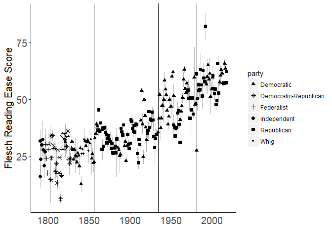
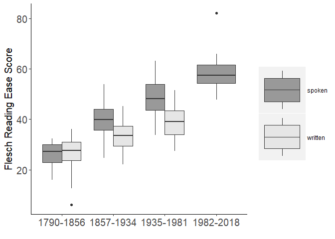
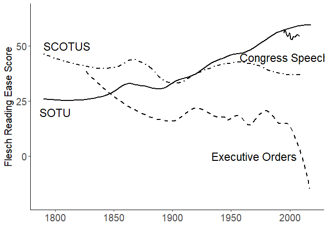
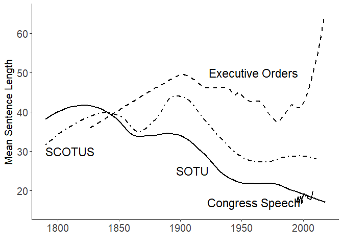
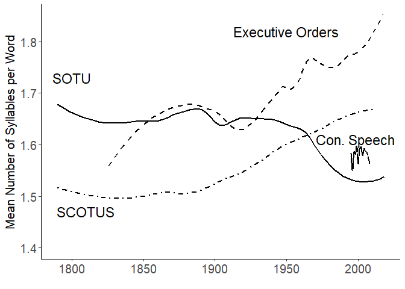
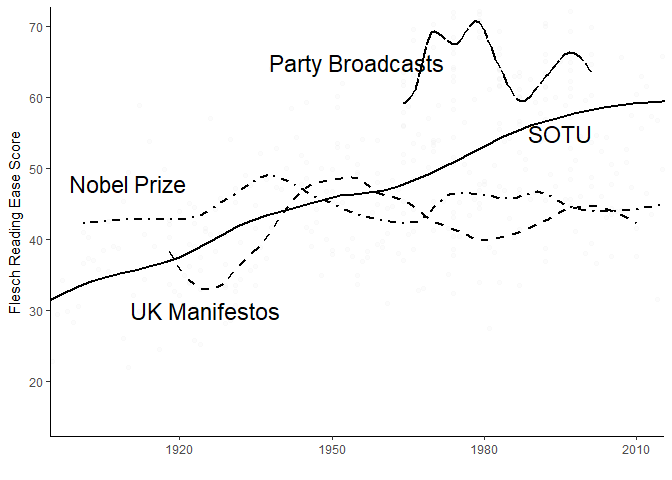
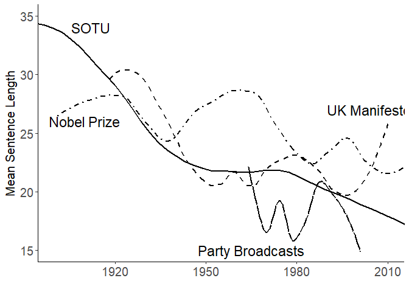
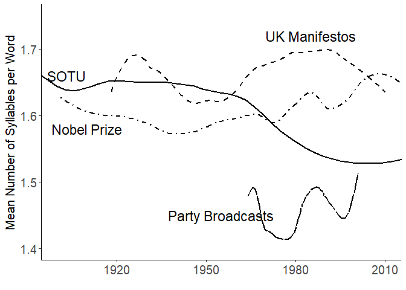

<!--
[](http://cran.r-project.org/package=sophistication)

[](https://travis-ci.org/kbenoit/sophistication)
[][1]
-->
Replication code for Benoit, Munger, and Spirling book chapter
--------------------------------------------------------------

"Dumbing Down? Trends in the Complexity of Political Communicationy" by Kenneth Benoit, Kevin Munger, and Arthur Spirling. This book chapter appears in an SSRC-funded "Anxieties of Democracy" edited volume, published by Cambridge University ress. The code presented here can be used to replicate all of the figures in this manuscript, and takes advantage of the concurrently developed [**sophistication**](https://github.com/kbenoit/sophistication) package.

### Installing **sophistication**

Using the **devtools** package:

``` r
devtools::install_github("kbenoit/sophistication")
```

### Figure 1

``` r
library(quanteda)
## Package version: 1.1.1
## Parallel computing: 2 of 8 threads used.
## See https://quanteda.io for tutorials and examples.
## 
## Attaching package: 'quanteda'
## The following object is masked from 'package:utils':
## 
##     View
library(sophistication)
## sophistication version 0.65
## Dropbox folder location set to: C:/Users/kevin/Dropbox/Benoit_Spirling_Readability/
library(stringr)
library(quanteda.corpora)
## compute readability and bootstrap the sentences
set.seed(20170308)
data(data_corpus_sotu, package = "quanteda.corpora")

results <- bootstrap_readability(data_corpus_sotu, n = 2, measure = "Flesch", verbose = FALSE)
## 1
##  2
bs_sd <- results$bs_sd[,"Flesch"]
stat <- results$original[,"Flesch"]
year <- lubridate::year(docvars(data_corpus_sotu, "Date"))
## calculate statistics for SOTU
library(trend)
library(strucchange)
## Loading required package: zoo
## 
## Attaching package: 'zoo'
## 
## The following objects are masked from 'package:base':
## 
##     as.Date, as.Date.numeric
## 
## Loading required package: sandwich
## 
## Attaching package: 'strucchange'
## 
## The following object is masked from 'package:stringr':
## 
##     boundary
sotu_mean <- mean(stat$Flesch)
sotu_var <- var(stat$Flesch)
sotu_cs_test <- cs.test(stat$Flesch)
sotu_ts <- as.ts(stat$Flesch)
sotu_breaks <- breakpoints(sotu_ts ~ 1 )
summary(sotu_breaks)
## 
##   Optimal (m+1)-segment partition: 
## 
## Call:
## breakpoints.formula(formula = sotu_ts ~ 1)
## 
## Breakpoints at observation number:
##                          
## m = 1             145    
## m = 2         124     176
## m = 3      68     145 194
## m = 4      68 112 146 194
## m = 5   34 68 112 146 194
## 
## Corresponding to breakdates:
##                          
## m = 1             145    
## m = 2         124     176
## m = 3      68     145 194
## m = 4      68 112 146 194
## m = 5   34 68 112 146 194
## 
## Fit:
##                                        
## m   0     1     2     3     4     5    
## RSS 40144 14775 11547  9719  9264  9230
## BIC  1865  1644  1598  1569  1568  1578


#3 breakpoints best fit the data
fm0 <- lm(stat$Flesch ~ breakfactor(sotu_breaks, breaks = 3))


sotu_breaks <- breakpoints(sotu_ts ~ 1, breaks = 3 )
year_breaks <- year[breakdates(sotu_breaks)]


## plot the trend
require(ggplot2)
## Loading required package: ggplot2
p <- ggplot(data = docvars(data_corpus_sotu),
            aes(x = year, y = stat)) + #, group = delivery)) +
  theme(panel.grid.major = element_blank(),
        panel.grid.minor = element_blank(),
        panel.background = element_blank(),
        axis.line = element_line(colour = "black")) +
  xlab("") +
  ylab("Flesch Reading Ease Score") +
  geom_errorbar(aes(ymin=stat-1.96*bs_sd, ymax=stat+1.96*bs_sd), colour="grey70", width=.1) +
  geom_point(aes(shape = party), size = 2, fill = "black") +
  scale_shape_manual(values = c(17, 8, 3, 19, 15, 20)) +
  geom_vline(aes(xintercept= year_breaks[1] ) ) +
  geom_vline(aes(xintercept= year_breaks[2] ) ) +
  geom_vline(aes(xintercept= year_breaks[3] ) ) +
  theme(plot.title = element_text(lineheight=.8, face="bold"),
        axis.text.x = element_text(size = 15),
        axis.text.y = element_text(size = 15), axis.title.y = element_text(size = 15))
print(p)
## Don't know how to automatically pick scale for object of type data.frame. Defaulting to continuous.
```



``` r


## Figure 2

# compute the levels
period <- cut(year, breaks = c(min(year), year_breaks, max(year)), include.lowest = TRUE, dig.lab = 4)
# reformat the levels
levs <- stringi::stri_replace_all_fixed(levels(period), c("[", "]", "("), "", vectorize_all = FALSE)
levs <- strsplit(levs, ",")
levs[2:length(levs)] <- lapply(levs[2:length(levs)], function(x) {
    x[1] <- as.integer(x[1]) + 1
    x
})
levels(period) <- sapply(levs, paste, collapse = "-")

ggplot(aes(y = stat$Flesch, x = period, fill = docvars(data_corpus_sotu, "delivery")),
       data = NULL) +
    geom_boxplot() +
    scale_fill_grey("", start = .6, end = .9) +
    theme(plot.title = element_text(lineheight=.8, face="bold"),
           axis.text.x = element_text(size = 15),
          axis.text.y = element_text(size = 15), axis.title.y = element_text(size = 15)) +
    labs(y = "Flesch Reading Ease Score", x = "") +
    theme(panel.grid.major = element_blank(),
          panel.grid.minor = element_blank(),
          panel.background = element_blank(),
          legend.key.size =  unit(2.5, "cm"),
          axis.line = element_line(colour = "black"))
```



``` r

##Figures 3, 5 and 7: US data


library(sophistication)
library(quanteda)
library(stringi)
## Warning: package 'stringi' was built under R version 3.4.4
library(magrittr)
library(dplyr)
## 
## Attaching package: 'dplyr'
## 
## The following objects are masked from 'package:stats':
## 
##     filter, lag
## 
## The following objects are masked from 'package:base':
## 
##     intersect, setdiff, setequal, union

data("data_corpus_sotu")


SOTU_stat <- textstat_readability(data_corpus_sotu, measure = c("Flesch", "meanSentenceLength", "meanWordSyllables"))

SOTU_year <- lubridate::year(docvars(data_corpus_sotu, "Date"))
SOTU_fre_df <- data.frame("year" = SOTU_year, "SOTU_stat" = SOTU_stat$Flesch)
SOTU_fre_sent <- data.frame("year" = SOTU_year, "SOTU_stat" = SOTU_stat$meanSentenceLength)
SOTU_fre_word <- data.frame("year" = SOTU_year, "SOTU_stat" = SOTU_stat$meanWordSyllables)


###EO

data("data_corpus_eo")


#drop the ones that are empty
clean1 <- data_corpus_eo$documents


##problems
clean1$texts<-stri_replace_all_fixed(clean1$texts, "A. D.", "AD")


#drop anything that's very long (95th percentile and above)
quant95 <- which( nchar(clean1$texts) >
                    quantile( nchar(clean1$texts), prob=.95) )
clean2 <- clean1[-quant95, c(1:2)]


eo_corp <- corpus(clean2, text_field = "texts")

##drop very short sentences
eo_corp <- corpus_trimsentences(eo_corp, min_length = 4)

eo_corp <- corpus_subset(eo_corp, ntoken(eo_corp) > 10)

eo_year <- docvars(eo_corp)


eo_stat <- textstat_readability(eo_corp$documents$texts, measure = c("Flesch", "meanSentenceLength", "meanWordSyllables"))

eo_fre_df <- data.frame("year" = eo_year$Year, "eo_stat" = eo_stat$Flesch)
eo_fre_sent <- data.frame("year" = eo_year$Year, "eo_stat" = eo_stat$meanSentenceLength)
eo_fre_word <- data.frame("year" = eo_year$Year, "eo_stat" = eo_stat$meanWordSyllables)


########SCOTUS
#load("C:/Users/kevin/Documents/GitHub/BMS_chapter_replication/data/data_corpus_SCOTUS.rda")
load("C:/Users/kevin/Desktop/data_corpus_SCOTUS.rda")

#drop the ones that are empty
clean1 <- corpus_subset(data_corpus_SCOTUS, nchar(texts(data_corpus_SCOTUS)) > 0)


## implement fixes
texts(clean1) <- stri_replace_all_fixed(texts(clean1), "U. S.", "US")


#drop anything that's very long (95th percentile and above)
temp_lengths <- stri_length(texts(clean1))
clean2 <- corpus_subset(clean1, temp_lengths <quantile(temp_lengths, prob = .95))
scotus_lengths<-ntoken(clean2, removePunct = T)

clean3 <- corpus_trimsentences(clean2, min_length = 4)

scotus_year <- clean3$documents$Year

scotus_stat <- textstat_readability(clean3$documents$texts, measure = c("Flesch", "meanSentenceLength", "meanWordSyllables"))

scotus_fre_df <- data.frame("year" = scotus_year, "scotus_stat" = scotus_stat$Flesch)
scotus_fre_sent <- data.frame("year" = scotus_year, "scotus_stat" = scotus_stat$meanSentenceLength)
scotus_fre_word <- data.frame("year" = scotus_year, "scotus_stat" = scotus_stat$meanWordSyllables)


##too many to plot well, and very unbalanced (way more modern ones)--try for a more balanced sample

years<-unique(scotus_fre_df$year)


indices<-vector()
for(i in 1:length(years)){
  set<-which(scotus_fre_df[,"year"]==years[i])
  num<-min(length(set), 30)
  samp<-sample(set, num, replace = FALSE)
  indices<-c(indices, samp)
}


balanced_scotus_fre_df<-scotus_fre_df[indices,]
balanced_scotus_fre_sent<-scotus_fre_sent[indices,]
balanced_scotus_fre_word<-scotus_fre_word[indices,]


require(reshape2)
## Loading required package: reshape2


###Congress
load("C:/Users/kevin/Desktop/data_corpus_CR.rdata")


#drop the ones that are by the speaker
speaker <- which( (data_corpus_CR$documents$name)=="Speaker" )
clean1 <- data_corpus_CR$documents[-speaker, ]


#drop anything that's very long (90th percentile and above)
quant95 <- which( nchar(clean1$texts) >
                    quantile( nchar(clean1$texts), prob=.95) )
clean2 <- clean1[-quant95, ]


##sync up year format

clean2$year[clean2$year==95]<-1995
clean2$year[clean2$year==96]<-1996
clean2$year[clean2$year==97]<-1997
clean2$year[clean2$year==98]<-1998
clean2$year[clean2$year==99]<-1999
clean2$year[clean2$year==0]<-2000
clean2$year[clean2$year==1]<-2001
clean2$year[clean2$year==2]<-2002
clean2$year[clean2$year==3]<-2003
clean2$year[clean2$year==4]<-2004
clean2$year[clean2$year==5]<-2005
clean2$year[clean2$year==6]<-2006
clean2$year[clean2$year==7]<-2007
clean2$year[clean2$year==8]<-2008


##take a very small sample--can't run readability on the whole thing
sample<-sample(seq(1,length(clean2$texts)), 10000, replace = F  )


sample_data<-clean2[sample,]


congress_year <- sample_data$year


congress_stat <- textstat_readability(sample_data$texts, measure = c("Flesch", "meanSentenceLength", "meanWordSyllables"))

congress_fre_df <- data.frame("year" = congress_year, "congress_stat" = congress_stat$Flesch)
congress_fre_sent <- data.frame("year" = congress_year, "congress_stat" = congress_stat$meanSentenceLength)
congress_fre_word <- data.frame("year" = congress_year, "congress_stat" = congress_stat$meanWordSyllables)


##melt together for plotting--Figure 3
require(reshape2)


df_US<-melt(list(SOTU=SOTU_fre_df, SCOTUS=balanced_scotus_fre_df, Congress = congress_fre_df,
                 ExecOrders = eo_fre_df), id.vars="year")


require(ggplot2)

linez<-c( "F1", "dashed",  "dotdash","solid")

p <- ggplot(data = df_US,
            aes(x = year, y = value, linetype = L1)) + #, group = delivery)) +
  theme(panel.grid.major = element_blank(),
        panel.grid.minor = element_blank(),
        panel.background = element_blank(),
        axis.line = element_line(colour = "black")) +
  geom_smooth(alpha=0.2,  method = "loess", span = .34, color = "black", se = F) +
  coord_cartesian(ylim = c(-20, 65)) +
  theme(legend.position="none", axis.text.x = element_text(size = 15),
        axis.text.y = element_text(size = 15), axis.title.y = element_text(size = 15))+
  scale_linetype_manual(values = linez)+
  xlab("") +
  ylab("Flesch Reading Ease Score") +
  theme(plot.title = element_text(lineheight=.8, face="bold")) +
  annotate("text", label = "Congress Speech", x = 1995, y = 45, size = 6, colour = "black")+
  
  annotate("text", label = "SOTU", x = 1800, y = 20, size = 6, colour = "black")+
  annotate("text", label = "SCOTUS", x = 1810, y = 50, size = 6, colour = "black") +
  annotate("text", label = "Executive Orders", x = 1970, y = 0, size = 6, colour = "black")


print(p)
```



``` r


##melt together for plotting--Figure 5


df_US_sent<-melt(list(SOTU=SOTU_fre_sent, SCOTUS=balanced_scotus_fre_sent, Congress = congress_fre_sent,
                 ExecOrders = eo_fre_sent), id.vars="year")


linez<-c( "F1", "dashed",  "dotdash","solid")


p <- ggplot(data = df_US_sent,
            aes(x = year, y = value, linetype = L1)) + #, group = delivery)) +
  theme(panel.grid.major = element_blank(),
        panel.grid.minor = element_blank(),
        panel.background = element_blank(),
        axis.line = element_line(colour = "black")) +
  geom_smooth(alpha=0.2,  method = "loess", span = .34, color = "black", se = F) +

  coord_cartesian(ylim = c(15, 65)) +
  theme(legend.position="none", axis.text.x = element_text(size = 15),
        axis.text.y = element_text(size = 15), axis.title.y = element_text(size = 15))+
  scale_linetype_manual(values = linez)+
  xlab("") +
  ylab("Mean Sentence Length") +

  theme(plot.title = element_text(lineheight=.8, face="bold")) +
  annotate("text", label = "Congress Speech", x = 1960, y = 17, size = 6, colour = "black")+
  annotate("text", label = "SOTU", x = 1910, y = 25, size = 6, colour = "black")+
  annotate("text", label = "SCOTUS", x = 1810, y = 30, size = 6, colour = "black") +
  annotate("text", label = "Executive Orders", x = 1960, y = 50, size = 6, colour = "black")


print(p)
```



``` r


##melt together for plotting--Figure 7


df_US_word<-melt(list(SOTU=SOTU_fre_word, SCOTUS=balanced_scotus_fre_word, Congress = congress_fre_word,
                      ExecOrders = eo_fre_word), id.vars="year")


p <- ggplot(data = df_US_word,
            aes(x = year, y = value, linetype = L1)) + #, group = delivery)) +
  theme(panel.grid.major = element_blank(),
        panel.grid.minor = element_blank(),
        panel.background = element_blank(),
        axis.line = element_line(colour = "black")) +
  geom_smooth(alpha=0.2,  method = "loess", span = .34, color = "black", se = F) +
coord_cartesian(ylim = c(1.4, 1.85)) +

theme(legend.position="none", axis.text.x = element_text(size = 15),
      axis.text.y = element_text(size = 15), axis.title.y = element_text(size = 15))+
  scale_linetype_manual(values = linez)+
  xlab("") +
  ylab("Mean Number of Syllables per Word") + theme(plot.title = element_text(lineheight=.8, face="bold")) +
  annotate("text", label = "SOTU", x = 1800, y = 1.73, size = 6, colour = "black")+
  annotate("text", label = "SCOTUS", x = 1810, y = 1.47, size = 6, colour = "black") +
  annotate("text", label = "Con. Speech", x = 1998, y = 1.61, size = 6, colour = "black")+
  
  annotate("text", label = "Executive Orders", x = 1950, y = 1.82, size = 6, colour = "black")

print(p)
```



``` r
##Figures 4, 6 and 8: Comparative data


data("data_corpus_sotu")


SOTU_stat <- textstat_readability(data_corpus_sotu, measure = c("Flesch", "meanSentenceLength", "meanWordSyllables"))

SOTU_year <- lubridate::year(docvars(data_corpus_sotu, "Date"))
SOTU_fre_df <- data.frame("year" = SOTU_year, "SOTU_stat" = SOTU_stat$Flesch)
SOTU_fre_sent <- data.frame("year" = SOTU_year, "SOTU_stat" = SOTU_stat$meanSentenceLength)
SOTU_fre_word <- data.frame("year" = SOTU_year, "SOTU_stat" = SOTU_stat$meanWordSyllables)

########nobel
#load("data_text/NobelLitePresentations/data_corpus_nobel.rdata")
load("C:/Users/kevin/Desktop/data_corpus_nobel.rdata")


temp_lengths <- stri_length(texts(data_corpus_nobel))
data_corpus_nobel <- corpus_subset(data_corpus_nobel, temp_lengths < quantile(temp_lengths, prob = .95))


nobel_corp <- corpus_trimsentences(data_corpus_nobel, min_length = 4)


nobel_lengths<-ntoken(nobel_corp, removePunct = T)


nobel_stat <- textstat_readability(nobel_corp, measure = c("Flesch", "meanSentenceLength", "meanWordSyllables"))

nobel_year <- (docvars(data_corpus_nobel, "year"))
nobel_fre_df <- data.frame("year" = nobel_year, "nobel_stat" = nobel_stat$Flesch)
nobel_fre_sent <- data.frame("year" = nobel_year, "nobel_stat" = nobel_stat$meanSentenceLength)
nobel_fre_word <- data.frame("year" = nobel_year, "nobel_stat" = nobel_stat$meanWordSyllables)


########Party Broadcasts

data("data_corpus_partybroadcasts")
temp_lengths <- stri_length(texts(data_corpus_partybroadcasts))
data_corpus_pb <- corpus_subset(data_corpus_partybroadcasts, temp_lengths < quantile(temp_lengths, prob = .95))

pb_corp <- corpus_trimsentences(data_corpus_pb, min_length = 4)

pb_lengths<-ntoken(pb_corp, removePunct = T)

###need to manually fix the dates
xx<-substr(texts(pb_corp), 1, 30)
xxx<-str_extract_all(xx,"\\(?[0-9,.]+\\)?")


pb_year <- numeric()
for(i in 1:length(xxx)){
  
  pb_year[i]<- as.numeric((xxx[[i]][length(xxx[[i]])]))
}
## Warning: NAs introduced by coercion
## Warning: NAs introduced by coercion

## Warning: NAs introduced by coercion
pb_year[4]<-1964

pb_year[10]<-1970

pb_year[14]<-1974
pb_year[22]<-1979


pb_stat <- textstat_readability(pb_corp, measure = c("Flesch", "meanSentenceLength", "meanWordSyllables"))


pb_fre_df <- data.frame("year" = pb_year, "pb_stat" = pb_stat$Flesch)
pb_fre_sent <- data.frame("year" = pb_year, "pb_stat" = pb_stat$meanSentenceLength)
pb_fre_word <- data.frame("year" = pb_year, "pb_stat" = pb_stat$meanWordSyllables)


########UK Manifestos

load("C:/Users/kevin/Desktop/data_corpus_man.rdata")

temp_lengths <- stri_length(texts(data_corpus_man))
data_corpus_man <- corpus_subset(data_corpus_man, temp_lengths < quantile(temp_lengths, prob = .95))


man_corp <- corpus_trimsentences(data_corpus_man, min_length = 4)


docvars(data_corpus_man)
##              Year
## Con1918.txt  1918
## Con1922.txt  1922
## Con1923.txt  1923
## Con1924.txt  1924
## Con1929.txt  1929
## Con1931.txt  1931
## Con1935.txt  1935
## Con1945.txt  1945
## Con1950.txt  1950
## Con1951.txt  1951
## Con1955.txt  1955
## Con1959.txt  1959
## Con1964.txt  1964
## Con1966.txt  1966
## Con1970.txt  1970
## Con1974a.txt 1974
## Con1974b.txt 1974
## Con1979.txt  1979
## Con1983.txt  1983
## Con1987.txt  1987
## Con1997.txt  1997
## Con2001.txt  2001
## Con2005.txt  2005
## Lab1918.txt  1918
## Lab1922.txt  1922
## Lab1923.txt  1923
## Lab1924.txt  1924
## Lab1929.txt  1929
## Lab1931.txt  1931
## Lab1935.txt  1935
## Lab1945.txt  1945
## Lab1950.txt  1950
## Lab1951.txt  1951
## Lab1955.txt  1955
## Lab1959.txt  1959
## Lab1964.txt  1964
## Lab1966.txt  1966
## Lab1970.txt  1970
## Lab1974a.txt 1974
## Lab1974b.txt 1974
## Lab1979.txt  1979
## Lab1987.txt  1987
## Lab1992.txt  1992
## Lab1997.txt  1997
## Lab2001.txt  2001
## Lab2005.txt  2005
## Lib1918.txt  1918
## Lib1922.txt  1922
## Lib1923.txt  1923
## Lib1924.txt  1924
## Lib1929.txt  1929
## Lib1931.txt  1931
## Lib1935.txt  1935
## Lib1945.txt  1945
## Lib1950.txt  1950
## Lib1951.txt  1951
## Lib1955.txt  1955
## Lib1959.txt  1959
## Lib1964.txt  1964
## Lib1966.txt  1966
## Lib1970.txt  1970
## Lib1974a.txt 1974
## Lib1974b.txt 1974
## Lib1979.txt  1979
## Lib1983.txt  1983
## Lib1987.txt  1987
## Lib1992.txt  1992
## Lib1997.txt  1997
## Lib2001.txt  2001
## Lib2005.txt  2005
## Lib2010.txt  2010


man_stat <- textstat_readability(man_corp, measure = c("Flesch", "meanSentenceLength", "meanWordSyllables"))

man_year <- (docvars(data_corpus_man, "Year"))
man_fre_df <- data.frame("year" = man_year, "man_stat" = man_stat$Flesch)
man_fre_sent <- data.frame("year" = man_year, "man_stat" = man_stat$meanSentenceLength)
man_fre_word <- data.frame("year" = man_year, "man_stat" = man_stat$meanWordSyllables)


##melt together for plotting--Figure 4
require(reshape2)


df_comp<-melt(list(SOTU=SOTU_fre_df, Manifestos=man_fre_df, Broadcasts = pb_fre_df,
                 Nobel = nobel_fre_df), id.vars="year")


require(ggplot2)

linez<-c( "F1", "dashed",  "dotdash","solid")


p <- ggplot(data = df_comp,
            aes(x = year, y = value, linetype = L1)) + #, group = delivery)) +
  theme(panel.grid.major = element_blank(),
        panel.grid.minor = element_blank(),
        panel.background = element_blank(),
        axis.line = element_line(colour = "black")) +
  geom_smooth(alpha=0.2,  method = "loess", span = .34, color = "black", se = F) +
  geom_point(alpha=0.01) + 
  coord_cartesian(ylim = c(15, 70), xlim=c(1900, 2010)) +
  theme(legend.position="none")+
  scale_linetype_manual(values = linez)+
  xlab("") +
  ylab("Flesch Reading Ease Score") +
  #geom_line(aes(), alpha=0.3, size = 1) +
  # ggtitle("Text Complexity in State of the Union Addresses") +
  theme(plot.title = element_text(lineheight=.8, face="bold")) +
  annotate("text", label = "SOTU", x = 1995, y = 55, size = 6, colour = "black")+
  annotate("text", label = "UK Manifestos", x = 1925, y = 30, size = 6, colour = "black") +
  annotate("text", label = "Party Broadcasts", x = 1955, y = 65, size = 6, colour = "black") + 
  annotate("text", label = "Nobel Prize", x = 1910, y = 48, size = 6, colour = "black")


print(p)
## Warning in simpleLoess(y, x, w, span, degree = degree, parametric =
## parametric, : pseudoinverse used at 1979
## Warning in simpleLoess(y, x, w, span, degree = degree, parametric =
## parametric, : neighborhood radius 5
## Warning in simpleLoess(y, x, w, span, degree = degree, parametric =
## parametric, : reciprocal condition number 7.9715e-017
## Warning in simpleLoess(y, x, w, span, degree = degree, parametric =
## parametric, : There are other near singularities as well. 16
```



``` r


##melt together for plotting--Figure 6


df_comp_sent<-melt(list(SOTU=SOTU_fre_sent, Manifestos=man_fre_sent, Broadcasts = pb_fre_sent,
                   Nobel = nobel_fre_sent), id.vars="year")


linez<-c( "F1", "dashed",  "dotdash","solid")


p <- ggplot(data = df_comp_sent,
            aes(x = year, y = value, linetype = L1)) + #, group = delivery)) +
  theme(panel.grid.major = element_blank(),
        panel.grid.minor = element_blank(),
        panel.background = element_blank(),
        axis.line = element_line(colour = "black")) +
  geom_smooth(alpha=0.2,  method = "loess", span = .34, color = "black", se = F) +
  coord_cartesian(ylim = c(15, 35), xlim=c(1900, 2010)) +
  theme(legend.position="none")+
  scale_linetype_manual(values = linez)+
  xlab("") +
  ylab("Mean Sentence Length") +
  theme(axis.text.x = element_text(size = 15),
        axis.text.y = element_text(size = 15), axis.title.y = element_text(size = 15)) +
  annotate("text", label = "SOTU", x = 1912, y = 34, size = 6, colour = "black")+
  annotate("text", label = "UK Manifestos", x = 2005, y = 27, size = 6, colour = "black") +
  annotate("text", label = "Party Broadcasts", x = 1965, y = 15, size = 6, colour = "black") + 
  annotate("text", label = "Nobel Prize", x = 1910, y = 26, size = 6, colour = "black")


print(p)
## Warning in simpleLoess(y, x, w, span, degree = degree, parametric =
## parametric, : pseudoinverse used at 1979
## Warning in simpleLoess(y, x, w, span, degree = degree, parametric =
## parametric, : neighborhood radius 5
## Warning in simpleLoess(y, x, w, span, degree = degree, parametric =
## parametric, : reciprocal condition number 7.9715e-017
## Warning in simpleLoess(y, x, w, span, degree = degree, parametric =
## parametric, : There are other near singularities as well. 16
```



``` r


##melt together for plotting--Figure 8


df_comp_word<-melt(list(SOTU=SOTU_fre_word, Manifestos=man_fre_word, Broadcasts = pb_fre_word,
                        Nobel = nobel_fre_word), id.vars="year")


p <- ggplot(data = df_comp_word,
            aes(x = year, y = value, linetype = L1)) + #, group = delivery)) +
  theme(panel.grid.major = element_blank(),
        panel.grid.minor = element_blank(),
        panel.background = element_blank(),
        axis.line = element_line(colour = "black")) +
  geom_smooth(alpha=0.2,  method = "loess", span = .34, color = "black", se = F) +
  coord_cartesian(ylim = c(1.4, 1.75), xlim=c(1900, 2010)) +
  theme(legend.position="none")+
  scale_linetype_manual(values = linez)+
  xlab("") +
  ylab("Mean Number of Syllables per Word") +
  theme(axis.text.x = element_text(size = 15),
        axis.text.y = element_text(size = 15), axis.title.y = element_text(size = 15)) +
  annotate("text", label = "SOTU", x = 1903, y = 1.66, size = 6, colour = "black")+
  annotate("text", label = "UK Manifestos", x = 1985, y = 1.72, size = 6, colour = "black") +
  annotate("text", label = "Party Broadcasts", x = 1955, y = 1.45, size = 6, colour = "black") + 
  annotate("text", label = "Nobel Prize", x = 1910, y = 1.58, size = 6, colour = "black")


print(p)
## Warning in simpleLoess(y, x, w, span, degree = degree, parametric =
## parametric, : pseudoinverse used at 1979
## Warning in simpleLoess(y, x, w, span, degree = degree, parametric =
## parametric, : neighborhood radius 5
## Warning in simpleLoess(y, x, w, span, degree = degree, parametric =
## parametric, : reciprocal condition number 7.9715e-017
## Warning in simpleLoess(y, x, w, span, degree = degree, parametric =
## parametric, : There are other near singularities as well. 16
```


